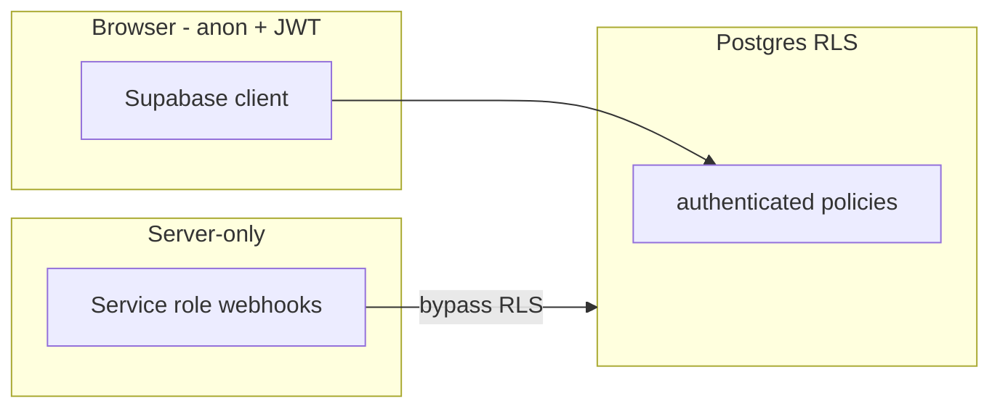

# Aether Permission Model

**Last updated:** 2026-06-01  
**Source of truth:** `supabase/migrations/*.sql` (especially `20260525000000_harden_security.sql` and `20260601000001_rls_permissions_hardening.sql`)

All tables use **Row Level Security (RLS)** for the `authenticated` role. The service role bypasses RLS and is reserved for verified webhooks/cron.

Policy logic is mirrored in `lib/rls-policies.ts` and tested in:

- `lib/__tests__/rls-policies.test.ts` — unit mirrors
- `lib/__tests__/rls-properties.test.ts` — randomized invariants
- `lib/__tests__/rls-violations.test.ts` — explicit cross-tenant denial scenarios

---

## Roles

| Role | Purpose |
|------|---------|
| `influencer` | Apply to campaigns, submit posts, receive payouts |
| `business` | Create campaigns, review applications, fund escrow |
| `admin` | Break-glass: post approval, role changes (service-managed) |

Roles live on `public.users.role`. **Users cannot self-promote to `admin`** (DB trigger `check_user_update`).

---

## Table-by-table matrix

### `users`

| Action | Who |
|--------|-----|
| SELECT | Self only |
| UPDATE | Self only (role changes: admin only) |
| INSERT | `auth.users` trigger (`handle_new_user`) |

### `profiles` (PK: `user_id`)

| Action | Who |
|--------|-----|
| SELECT | Self; **influencer** profiles (marketplace discovery); profiles of users in a **shared participation** with you |
| UPDATE | Self only |
| INSERT | Self only |

**Why:** Business profiles (company name, Stripe Connect IDs) are no longer world-readable. Influencer discovery stays public.

### `campaigns`

| Action | Who |
|--------|-----|
| SELECT | Owner always; others only if `status != 'draft'` |
| INSERT | `business` or `admin`, `business_id = auth.uid()` |
| UPDATE / DELETE | Owner (`business_id = auth.uid()`) |

**Why:** Draft budgets/briefs stay private until published.

### `participations`

| Action | Who |
|--------|-----|
| SELECT | Participating influencer **or** campaign business |
| INSERT | Influencer applying as self |
| UPDATE | Influencer **or** campaign business |
| DELETE | Influencer, only while `status = 'applied'` |

**Why:** One influencer cannot read another’s application on the same campaign.

### `posts`

| Action | Who |
|--------|-----|
| SELECT / UPDATE (row) | Participation member (influencer or business) |
| INSERT | Participating influencer |
| DELETE | Participating influencer |
| UPDATE `approved_at` | Campaign business or admin (trigger `check_post_update`) |
| UPDATE content/URL | Participating influencer or admin (trigger) |

**Why:** Creators cannot self-approve; businesses cannot rewrite post URLs.

### `transactions`

| Action | Who |
|--------|-----|
| SELECT | `user_id = auth.uid()` **or** participation member |
| INSERT | Business on linked participation (`user_id` null or self); influencer `payout` with `user_id = auth.uid()` |

### `notifications`

| Action | Who |
|--------|-----|
| SELECT / UPDATE / DELETE | Recipient (`user_id = auth.uid()`) |
| INSERT | Self **or** campaign counterparty (business ↔ influencer on same participation) |

**Why:** Blocks spamming arbitrary users with in-app notifications.

### `ratings`

| Action | Who |
|--------|-----|
| SELECT | Reviewer, reviewee, or campaign participant |
| INSERT | Reviewer who is a participant on that campaign |

### `messages`

| Action | Who |
|--------|-----|
| SELECT | Sender **or** participation member |
| INSERT | Sender who is a participation member |
| UPDATE | Participation member — **`is_read` only** (trigger `check_message_update`) |

---

## Trust boundaries



| Path | Enforcement |
|------|-------------|
| Client → Supabase | RLS on every table |
| Next.js API routes | Zod + auth + rate limits (`lib/api/*`) |
| Stripe webhook | Signature + service role |
| Cron | `CRON_SECRET` bearer |

---

## Intentionally public (authenticated)

These are **product** choices, not oversights:

1. **Open campaigns** — Any logged-in user can browse non-draft campaigns (marketplace).
2. **Influencer profiles** — Discoverable for matching; business profiles are not.
3. **Campaign embeddings** — Visible on open campaigns for AI features.

---

## Applying migrations

```bash
supabase db push
# or run SQL in Supabase dashboard
```

After deploy, run:

```bash
npm test
```

---

## Related docs

- [SECURITY.md](./SECURITY.md) — API secrets, rate limits, residual risks