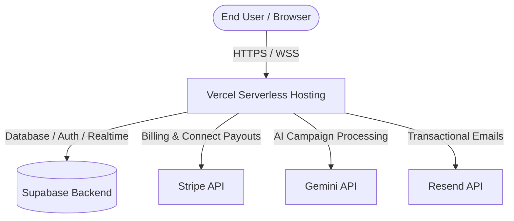

> ⚠️ **Outdated — predates the performance migration and the worker.** For current
> setup (migrations, worker, Redis, Stripe pool funding) see [SETUP.md](../SETUP.md);
> for state and risks see [HANDOFF.md](../HANDOFF.md).

# How to Launch Aether Today: Live Deployment Guide

This guide details the end-to-end operational blueprint to deploy and launch Aether in a live production environment. 

Aether's architecture integrates **Next.js 16 (App Router)** hosted on **Vercel** with **Supabase** (Database, Auth, and Storage), **Stripe Connect** (Escrow and Payouts), **Google Gemini AI** (Brief & Pitch Generation), and **Resend** (Transactional Notifications).

---

## Deployment Architecture



---

## 1. Environment Variables Reference

Configure these environment variables in your production hosting provider (e.g., Vercel Dashboard). Never commit live production secrets to git.

| Variable Name | Scope | Description | Production Example Value |
| :--- | :--- | :--- | :--- |
| **`NEXT_PUBLIC_SUPABASE_URL`** | Client & Server | The API endpoint of your live Supabase project. | `https://xypqrs.supabase.co` |
| **`NEXT_PUBLIC_SUPABASE_ANON_KEY`** | Client & Server | The public anonymous key for RLS-gated client actions. | `eyJhbGciOiJIUzI1NiIsInR5cCI...` |
| **`STRIPE_SECRET_KEY`** | Server Only | Private API key for processing Escrow and Connect requests. | `sk_live_51Pq...` (Live) or `sk_test_...` (Test) |
| **`NEXT_PUBLIC_STRIPE_PUBLISHABLE_KEY`** | Client & Server | Public key used to initialize the Stripe Elements client-side. | `pk_live_51Pq...` (Live) or `pk_test_...` (Test) |
| **`STRIPE_WEBHOOK_SECRET`** | Server Only | Secret token used to cryptographically verify incoming Stripe events. | `whsec_...` |
| **`GEMINI_API_KEY`** | Server Only | Google AI Studio key for processing Briefs and Creator Pitch drafts. | `AIzaSy...` |
| **`RESEND_API_KEY`** | Server Only | Mail transmission key for sending automated match/payout alerts. | `re_...` |
| **`NEXT_PUBLIC_APP_URL`** | Client & Server | Root canonical origin of the application. Used for redirect URIs. | `https://aether.inc` |

---

## 2. Vercel-Ready Production Checklist

Ensure every item on this checklist is marked off before completing production deployment.

### A. Next.js 16 + React 19 Build Settings
- [ ] **Strict Build Checks**: Update `next.config.ts` to disable build-level ignores. Turn off debug-bypass toggles:
  ```typescript
  // next.config.ts
  const nextConfig: NextConfig = {
    eslint: {
      ignoreDuringBuilds: false, // Set to false for production safety
    },
    typescript: {
      ignoreBuildErrors: false,  // Set to false for production safety
    },
  };
  ```
- [ ] **Node.js Runtime**: Set your Vercel Node runtime version to `20.x` or higher (compatible with Next.js 16).

### B. Supabase Production Hardening
- [ ] **Run Migrations**: Apply all DB schemas from `/supabase/migrations` (or `/docs/migrations/`) to your production database.
- [ ] **Row Level Security (RLS)**: Run tests from `docs/testing.md` to guarantee all tables are RLS-active and secure. No client should bypass security policies.
- [ ] **Disable Test Seeding**: Do NOT run seed scripts on your production database. Let the initial database state bootstrap organically through user onboarding.
- [ ] **Auth Redirect Configuration**: 
  - Go to **Supabase Dashboard -> Authentication -> URL Configuration**.
  - Set **Site URL** to `https://yourdomain.com`.
  - Add Redirect URLs: `https://yourdomain.com/**` and `https://yourdomain.com/auth/callback`.

### C. Email and Communications
- [ ] **Domain Verification**: Add your domain to the **Resend Dashboard** and configure SPF, DKIM, and DMARC DNS records.
- [ ] **Transactional Sender Address**: In `lib/resend.ts`, verify the `from` address is aligned with your verified sending domain (e.g. `notifications@yourdomain.com`).

---

## 3. SEO & PWA Verification

Aether features a fully responsive, Apple-inspired progressive web application layout and semantic SEO.

- **Viewport Tag**: Managed dynamically in Next.js 16 via `export const viewport` in `app/layout.tsx`.
- **Search Metadata**: OpenGraph, Twitter Cards, and search crawlers metadata are set globally. Customize page-specific tags dynamically inside page components using `export async function generateMetadata()`.
- **PWA Manifest**: Located at `/app/manifest.ts`. Verify standard app installation capability in the browser developer tools (Application -> Manifest).
- **Service Worker**: The PWA service worker `/sw.js` is automatically registered upon client load for notification handling.

---

## 4. Stripe Live Mode Transition

Aether is configured to run in **Test Mode** by default. To transition Aether to **Live Mode**, complete the following operational steps:

### Step 1: Update API Keys
Change the following environment variables in Vercel to use your Stripe production values:
- `STRIPE_SECRET_KEY` -> Replace `sk_test_...` with `sk_live_...`
- `NEXT_PUBLIC_STRIPE_PUBLISHABLE_KEY` -> Replace `pk_test_...` with `pk_live_...`

### Step 2: Configure Live Webhook in Stripe Dashboard
1. Go to the **Stripe Dashboard** (make sure Test Mode toggle is OFF).
2. Navigate to **Developers -> Webhooks** and click **Add Endpoint**.
3. Set your endpoint URL to: `https://your-domain.com/api/webhooks/stripe`
4. Select the following events:
   - `checkout.session.completed` (for campaign deposit payments)
   - `account.updated` (for connected influencer onboarding status)
5. Save the endpoint and copy the **Signing Secret** (`whsec_...`).
6. Set the `STRIPE_WEBHOOK_SECRET` environment variable in Vercel to this new signing secret.

### Step 3: Connect Platform Redirect Settings
1. Go to **Stripe Dashboard -> Connect -> Settings**.
2. Under **Integration**, configure the redirect URI matching your production onboarding endpoints:
   - `https://your-domain.com/stripe/callback`
3. Ensure the Connect OAuth onboarding flow is active.

---

## 5. One-Click Deploy Script

Use the helper script below to dry-run build tests, compile assets, push migrations, and trigger Vercel deployment.

Save this script locally to `scripts/deploy.sh` and make it executable: `chmod +x scripts/deploy.sh`.

```bash
#!/bin/bash

# Aether Production Deployment Orchestrator
# Assumes Vercel CLI and Supabase CLI are configured.

set -e

# Color definitions
RED='\033[0;31m'
GREEN='\033[0;32m'
BLUE='\033[0;34m'
NC='\033[0m' # No Color

echo -e "${BLUE}=== Starting Aether Production Deploy Process ===${NC}"

# 1. Run local validation tests
echo -e "\n${BLUE}[1/4] Running local typechecks and build tests...${NC}"
npm run build

# 2. Check Vercel CLI Authentication
echo -e "\n${BLUE}[2/4] Verifying Vercel authentication...${NC}"
if ! vercel whoami >/dev/null 2>&1; then
  echo -e "${RED}Error: You are not logged into Vercel CLI. Run 'vercel login' first.${NC}"
  exit 1
fi
echo -e "${GREEN}Vercel Authenticated.${NC}"

# 3. DB Migrations check
echo -e "\n${BLUE}[3/4] Database migrations status check...${NC}"
read -p "Have you applied migrations to your live Supabase DB? (y/n): " confirm_db
if [ "$confirm_db" != "y" ]; then
  echo -e "${RED}Please apply your Supabase migrations first. Aborting deploy.${NC}"
  exit 1
fi

# 4. Trigger Vercel Production Build
echo -e "\n${BLUE}[4/4] Deploying to Vercel...${NC}"
vercel --prod

echo -e "\n${GREEN}=== Aether Deployment Successful! ===${NC}"
```
