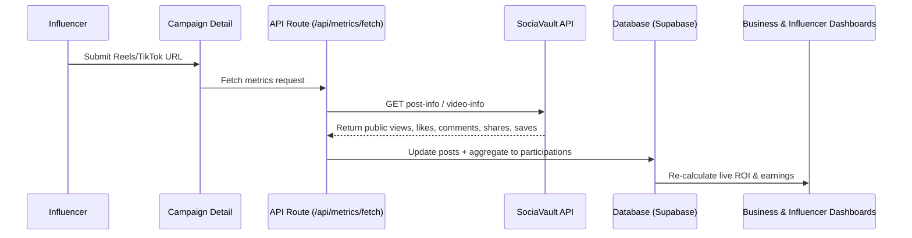

> ⚠️ **Outdated — describes the original fixed-fee metrics/scraping approach (SociaVault).**
> View tracking is now handled by the worker's trusted provider router
> (`worker/views-provider.ts`) using official YouTube/TikTok providers plus
> optional Ayrshare fallback feeding the earnings pipeline.
> See [HANDOFF.md](../HANDOFF.md) for the model and [SETUP.md](../SETUP.md) for running the worker.

# Aether Social Metrics Monitoring System

This document outlines how Aether automatically tracks and monitors social media deliverables (Instagram Reels + TikTok videos) to drive real-time Live ROI metrics, campaign payouts, and brand dashboards.

---

## 1. Core Architecture

Aether integrates with **SociaVault**, a unified public scraper API that retrieves public video stats (Reels & TikToks) without requiring complex, user-facing OAuth logins.



---

## 2. Setting Up SociaVault (API Provider)

To enable automatic social scraping in production, follow these steps to sign up and configure the API key.

### Step 1: Sign Up
- Go to the official signup page: [SociaVault Registration](https://sociavault.com)
- Create a developer account.

### Step 2: Pricing & Free Trial
- **Free Tier:** All new accounts receive **50 free scraping credits** upon email verification.
- **Pricing Model:** Pay-as-you-go credit-based structure. Most endpoints cost exactly **1 credit per request**.
  - 1,000 credits = €10.00
  - 10,000 credits = €75.00
  - Credits **never expire**, meaning there are no monthly subscription minimums.

### Step 3: Retrieve the API Key
- Navigate to your **SociaVault Developer Dashboard**.
- Copy your unique API key (usually starting with `sv_`).

### Step 4: Configure Environment Variables
Add the key to your `.env.local` or environment settings:
```bash
SOCIAVAULT_API_KEY=sv_your_actual_key_here
```
*Note: `SOCIAVAULT_API_KEY` is required for metric fetching. The `/api/metrics/fetch` route returns `503` when it is not configured — there is no simulated fallback.*

---

## 3. Supported Platforms & Endpoints

Aether supports both Instagram Reels and TikTok videos identically. 

### Instagram Reels
- **Scraper Endpoint:** `GET https://api.sociavault.com/v1/scrape/instagram/post-info?url={post_url}`
- **Extracted Fields:**
  - `views`: Mapped from `video_play_count`
  - `likes`: Mapped from `edge_media_preview_like.count`
  - `comments`: Mapped from `edge_media_to_parent_comment.count`
  - `shares`: Mapped from `share_count`
  - `saves`: Mapped from `save_count`
  - `caption`: Extracted from caption nodes.

### TikTok Videos
- **Scraper Endpoint:** `GET https://api.sociavault.com/v1/scrape/tiktok/video-info?url={post_url}`
- **Extracted Fields:**
  - `views`: Mapped from `play_count`
  - `likes`: Mapped from `digg_count`
  - `comments`: Mapped from `comment_count`
  - `shares`: Mapped from `share_count`
  - `saves`: Mapped from `collect_count`
  - `caption`: Extracted from the video description (`desc`).

---

## 4. Live ROI Calculation Rules

Live ROI calculations are computed dynamically using:
$$\text{Engagement Rate} = \frac{\text{likes} + \text{comments} + \text{shares} + \text{saves}}{\text{views}} \times 100$$
$$\text{Attributed Clicks} = \text{views} \times 0.05 \quad (5\% \text{ clickthrough baseline})$$
$$\text{Attributed Sales} = \text{Attributed Clicks} \times 0.02 \quad (2\% \text{ sales conversion baseline})$$
$$\text{Attributed Value} = \text{Attributed Sales} \times €85 \quad (€85 \text{ Average Order Value (AOV)})$$
$$\text{Live ROI} = \frac{\text{Attributed Value}}{\text{Contract Payout}}$$

All values sync instantly to `participations.performance_data` in the database, allowing both brands and creators to view campaign ROI in real time.

---

## 5. Daily Cron Job Sync

To keep metrics fresh, a daily cron job runs automatically:
- **Endpoint:** `/api/cron/metrics`
- **Schedule:** Suggested once daily (at midnight UTC).
- **Execution:** Sequentially loops over active participations (status `in_progress` or `submitted`) and refreshes metrics from SociaVault.
- **Verification:** Secure headers can be configured via `CRON_SECRET` environment variable in production.
