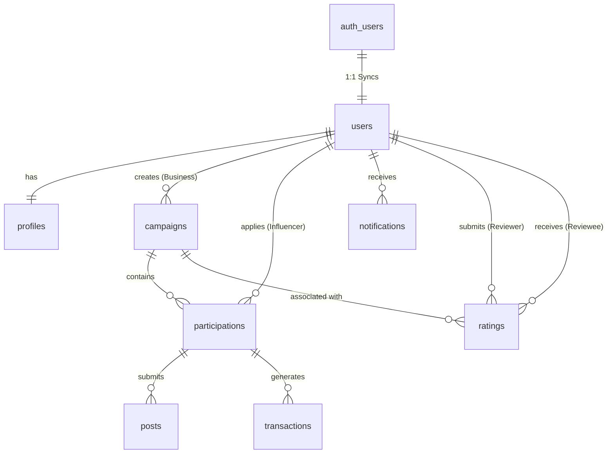

# Aether Database Schema Specification v1.0

This document defines the PostgreSQL schema designed for Aether, built on Supabase. It includes table structures, Row-Level Security (RLS) policies, database triggers, index optimizations, and future AI matchmaking stubs.

---

## 1. Entity-Relationship Diagram

The following Mermaid diagram shows the relational schema of the Aether platform:



---

## 2. Table Definitions

### 2.1 Users (`public.users`)
Mirrors and extends `auth.users` for platform-specific roles.

| Column | Type | Constraints | Description |
| :--- | :--- | :--- | :--- |
| `id` | `UUID` | `PRIMARY KEY`, `REFERENCES auth.users(id) ON DELETE CASCADE` | Unique user identifier matching Supabase Auth. |
| `email` | `TEXT` | `UNIQUE`, `NOT NULL` | User email address. |
| `role` | `public.user_role` | `NOT NULL`, `DEFAULT 'influencer'` | Role: `'business'`, `'influencer'`, or `'admin'`. |
| `created_at` | `TIMESTAMPTZ` | `NOT NULL`, `DEFAULT now()` | Creation timestamp. |
| `updated_at` | `TIMESTAMPTZ` | `NOT NULL`, `DEFAULT now()` | Last update timestamp. |

### 2.2 Profiles (`public.profiles`)
Holds detailed demographic, social metric, and rate information for users.

| Column | Type | Constraints | Description |
| :--- | :--- | :--- | :--- |
| `user_id` | `UUID` | `PRIMARY KEY`, `REFERENCES public.users(id) ON DELETE CASCADE` | Links to the user. |
| `full_name` | `TEXT` | `NOT NULL`, `DEFAULT ''` | User's full name. |
| `avatar_url` | `TEXT` | - | Avatar image URL. |
| `bio` | `TEXT` | - | Biography or tagline. |
| `niches` | `TEXT[]` | `NOT NULL`, `DEFAULT '{}'` | Content genres (e.g. Tech, Fashion, Food). |
| `follower_count` | `INTEGER` | `NOT NULL`, `DEFAULT 0` | Aggregated follower count. |
| `engagement_rate` | `NUMERIC(5,2)` | `NOT NULL`, `DEFAULT 0.00` | Avg engagement percentage (e.g. 4.85%). |
| `audience_demographics`| `JSONB` | `NOT NULL`, `DEFAULT '{}'::jsonb` | Audience age/gender/location percentages. |
| `social_handles` | `JSONB` | `NOT NULL`, `DEFAULT '{}'::jsonb` | Social profiles: `{ instagram: "@handle", ... }`. |
| `rate_card` | `JSONB` | `NOT NULL`, `DEFAULT '{}'::jsonb` | Prices by deliverable type: `{ reel: 450, ... }`. |
| `authenticity_score` | `NUMERIC(3,2)` | `NOT NULL`, `DEFAULT 1.00` | Fraud detection score (0.00 - 1.00). |
| `availability` | `JSONB` | `NOT NULL`, `DEFAULT '{}'::jsonb` | Status: `{ status: "available" }`. |
| `embedding` | `vector(1536)` | - | AI embedding representation (for search & matching). |
| `created_at` | `TIMESTAMPTZ` | `NOT NULL`, `DEFAULT now()` | Creation timestamp. |
| `updated_at` | `TIMESTAMPTZ` | `NOT NULL`, `DEFAULT now()` | Last update timestamp. |

### 2.3 Campaigns (`public.campaigns`)
Marketing campaigns posted by businesses.

| Column | Type | Constraints | Description |
| :--- | :--- | :--- | :--- |
| `id` | `UUID` | `PRIMARY KEY`, `DEFAULT gen_random_uuid()` | Campaign identifier. |
| `business_id` | `UUID` | `NOT NULL`, `REFERENCES public.users(id) ON DELETE CASCADE` | Business creator. |
| `title` | `TEXT` | `NOT NULL` | Campaign title. |
| `description` | `TEXT` | - | Core brief and requirements. |
| `budget_total` | `NUMERIC(12,2)`| `NOT NULL` | Overall campaign budget. |
| `budget_allocated`| `NUMERIC(12,2)`| `NOT NULL`, `DEFAULT 0.00` | Locked/assigned budget. |
| `target_niches` | `TEXT[]` | `NOT NULL`, `DEFAULT '{}'` | Niches required for the campaign. |
| `target_audience` | `JSONB` | `NOT NULL`, `DEFAULT '{}'::jsonb` | Required demographics parameters. |
| `deliverables` | `JSONB` | `NOT NULL`, `DEFAULT '{}'::jsonb` | Deliverable specs (type, quantity). |
| `timeline` | `JSONB` | `NOT NULL`, `DEFAULT '{}'::jsonb` | Start/end dates, draft review dates. |
| `status` | `public.campaign_status` | `NOT NULL`, `DEFAULT 'draft'` | Status: `'draft'`, `'open'`, `'in_progress'`, `'completed'`, `'cancelled'`. |
| `embedding` | `vector(1536)` | - | Description embedding for smart matching. |
| `created_at` | `TIMESTAMPTZ` | `NOT NULL`, `DEFAULT now()` | Creation timestamp. |
| `updated_at` | `TIMESTAMPTZ` | `NOT NULL`, `DEFAULT now()` | Last update timestamp. |

### 2.4 Participations (`public.participations`)
Collaborative linkages between influencers and campaigns.

| Column | Type | Constraints | Description |
| :--- | :--- | :--- | :--- |
| `id` | `UUID` | `PRIMARY KEY`, `DEFAULT gen_random_uuid()` | Participation identifier. |
| `campaign_id` | `UUID` | `NOT NULL`, `REFERENCES public.campaigns(id) ON DELETE CASCADE` | The campaign. |
| `influencer_id` | `UUID` | `NOT NULL`, `REFERENCES public.users(id) ON DELETE CASCADE` | The influencer. |
| `status` | `public.participation_status` | `NOT NULL`, `DEFAULT 'applied'` | Status: `'applied'`, `'offered'`, `'accepted'`, `'declined'`, `'completed'`, `'cancelled'`. |
| `proposed_payout` | `NUMERIC(12,2)`| `NOT NULL` | Negotiated payout amount. |
| `actual_payout` | `NUMERIC(12,2)`| `NOT NULL`, `DEFAULT 0.00` | Transferred payout amount. |
| `performance_data`| `JSONB` | `NOT NULL`, `DEFAULT '{}'::jsonb` | Live campaign performance analytics. |
| `applied_at` | `TIMESTAMPTZ` | `NOT NULL`, `DEFAULT now()` | Application timestamp. |
| `updated_at` | `TIMESTAMPTZ` | `NOT NULL`, `DEFAULT now()` | Last update timestamp. |

*Unique constraint:* `(campaign_id, influencer_id)` ensures an influencer can apply only once per campaign.

### 2.5 Posts (`public.posts`)
Content deliverables submitted for campaigns.

| Column | Type | Constraints | Description |
| :--- | :--- | :--- | :--- |
| `id` | `UUID` | `PRIMARY KEY`, `DEFAULT gen_random_uuid()` | Post identifier. |
| `participation_id` | `UUID` | `NOT NULL`, `REFERENCES public.participations(id) ON DELETE CASCADE` | Linked participation agreement. |
| `platform` | `TEXT` | `NOT NULL` | Platform (e.g. `'instagram'`, `'tiktok'`). |
| `post_url` | `TEXT` | `NOT NULL` | Link to the live post. |
| `metrics` | `JSONB` | `NOT NULL`, `DEFAULT '{}'::jsonb` | Analytics: `{ impressions, reach, likes, ... }`. |
| `submitted_at` | `TIMESTAMPTZ` | `NOT NULL`, `DEFAULT now()` | Submit timestamp. |
| `approved_at` | `TIMESTAMPTZ` | - | Business approval timestamp. |
| `created_at` | `TIMESTAMPTZ` | `NOT NULL`, `DEFAULT now()` | Creation timestamp. |
| `updated_at` | `TIMESTAMPTZ` | `NOT NULL`, `DEFAULT now()` | Last update timestamp. |

### 2.6 Transactions (`public.transactions`)
Escrows, payouts, and other ledger entries mapping to Stripe.

| Column | Type | Constraints | Description |
| :--- | :--- | :--- | :--- |
| `id` | `UUID` | `PRIMARY KEY`, `DEFAULT gen_random_uuid()` | Ledger identifier. |
| `participation_id` | `UUID` | `REFERENCES public.participations(id) ON DELETE CASCADE` | Linked campaign participation. |
| `amount` | `NUMERIC(12,2)`| `NOT NULL` | Payment volume. |
| `type` | `public.transaction_type` | `NOT NULL` | Type: `'escrow'`, `'release'`, `'bonus'`, `'refund'`. |
| `stripe_payment_intent_id`| `TEXT` | - | Stripe API Reference. |
| `status` | `public.transaction_status` | `NOT NULL`, `DEFAULT 'pending'` | Status: `'pending'`, `'succeeded'`, `'failed'`, `'refunded'`. |
| `created_at` | `TIMESTAMPTZ` | `NOT NULL`, `DEFAULT now()` | Transaction creation timestamp. |
| `updated_at` | `TIMESTAMPTZ` | `NOT NULL`, `DEFAULT now()` | Last update timestamp. |

### 2.7 Notifications (`public.notifications`)
Transactional user notices.

| Column | Type | Constraints | Description |
| :--- | :--- | :--- | :--- |
| `id` | `UUID` | `PRIMARY KEY`, `DEFAULT gen_random_uuid()` | Notification identifier. |
| `user_id` | `UUID` | `NOT NULL`, `REFERENCES public.users(id) ON DELETE CASCADE` | Recipient. |
| `title` | `TEXT` | `NOT NULL` | Short title. |
| `content` | `TEXT` | `NOT NULL` | Full text detail. |
| `type` | `TEXT` | `NOT NULL` | Type: `'campaign_invite'`, `'payment'`, etc. |
| `is_read` | `BOOLEAN` | `NOT NULL`, `DEFAULT false` | Read status. |
| `created_at` | `TIMESTAMPTZ` | `NOT NULL`, `DEFAULT now()` | Trigger timestamp. |

### 2.8 Ratings (`public.ratings`)
Double-sided reviews submitted after collaborations complete.

| Column | Type | Constraints | Description |
| :--- | :--- | :--- | :--- |
| `id` | `UUID` | `PRIMARY KEY`, `DEFAULT gen_random_uuid()` | Rating identifier. |
| `campaign_id` | `UUID` | `NOT NULL`, `REFERENCES public.campaigns(id) ON DELETE CASCADE` | Contextual campaign. |
| `reviewer_id` | `UUID` | `NOT NULL`, `REFERENCES public.users(id) ON DELETE CASCADE` | Reviewer user. |
| `reviewee_id` | `UUID` | `NOT NULL`, `REFERENCES public.users(id) ON DELETE CASCADE` | Reviewed user. |
| `score` | `INTEGER` | `NOT NULL`, `CHECK (score >= 1 AND score <= 5)` | Rating value. |
| `comment` | `TEXT` | - | Text review comment. |
| `created_at` | `TIMESTAMPTZ` | `NOT NULL`, `DEFAULT now()` | Submit timestamp. |

*Unique constraint:* `(campaign_id, reviewer_id)` ensures a user can review their counterpart only once per campaign.

---

## 3. Database Triggers & Functions

To enforce modularity and ensure perfect data consistency, Aether employs database triggers:

### 3.1 `handle_new_user()`
*   **Trigger Event:** `AFTER INSERT ON auth.users`
*   **Operation:** Automatically reads sign-up metadata (role, full name, avatar) and inserts a corresponding entry into both `public.users` and `public.profiles`.
*   **Sign-Up Payload mapping:**
    ```json
    {
      "role": "business" | "influencer",
      "full_name": "Full Name",
      "avatar_url": "https://..."
    }
    ```

### 3.2 `handle_update_user()`
*   **Trigger Event:** `AFTER UPDATE OF email ON auth.users`
*   **Operation:** Synchronizes email adjustments made inside Supabase Auth directly to `public.users(email)`.

---

## 4. Row-Level Security (RLS) Policies

All tables have RLS enabled by default. Secure policies govern access:

### 4.1 Users & Profiles
*   **SELECT:** Any authenticated user can read profiles (necessary for search/matchmaking).
*   **UPDATE:** Allowed only if `auth.uid() = id` (or `user_id` on profiles).

### 4.2 Campaigns
*   **SELECT:** Allowed if campaign status is not `'draft'` OR if the user is the creator (`auth.uid() = business_id`).
*   **INSERT:** Allowed only if the user has the `'business'` or `'admin'` role and matches `business_id`.
*   **UPDATE/DELETE:** Allowed only if the user is the campaign owner (`auth.uid() = business_id`).

### 4.3 Participations, Posts & Transactions
*   **SELECT:** Allowed only if the authenticated user is the participating influencer OR the business owning the campaign.
*   **INSERT/UPDATE (Participations):** Influencer can apply; both can negotiate or change status depending on workflow stages.
*   **INSERT/UPDATE (Posts):** Only the participating influencer can insert/modify posts.
*   **INSERT (Transactions):** Only the campaign owner (business) or system admin can create transaction records (fund escrow, release payment).

### 4.4 Notifications
*   **SELECT/UPDATE/DELETE:** Restrained exclusively to the owner (`auth.uid() = user_id`).

### 4.5 Ratings
*   **SELECT:** Read access is public to authenticated users to dynamically compute reputation ratings.
*   **INSERT:** Restrained to verified collaborators of the specific campaign.

---

## 5. Performance Optimization Indexes

High-traffic indexes are established to optimize common search patterns:
1.  **Role Lookup:** Index on `users(role)` for dashboard dispatching.
2.  **Influencer Search:** Multi-column index on `profiles(follower_count)` and `profiles(engagement_rate)` to accelerate filtration queries by businesses.
3.  **Active Campaigns:** Indexes on `campaigns(business_id)` and `campaigns(status)` for campaign pipelines.
4.  **Applications & Agreements:** Indexes on `participations(campaign_id, influencer_id)` and `participations(status)` for application queues.
5.  **Notifications & Audits:** Indexes on `notifications(user_id, is_read)` to quickly retrieve unread notifications.
